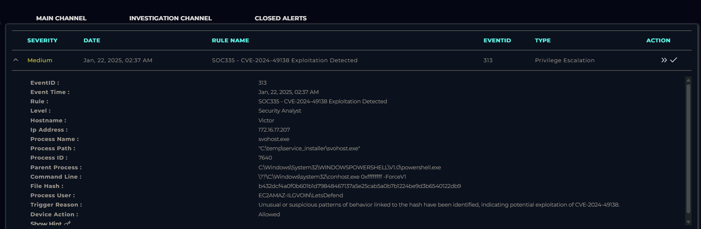
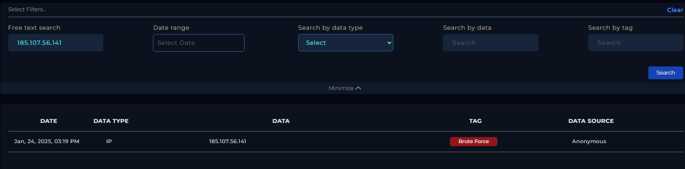
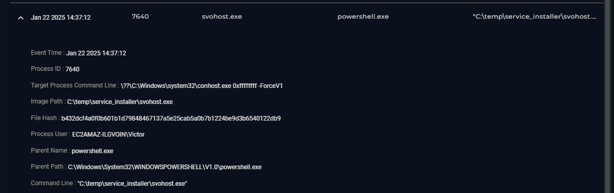
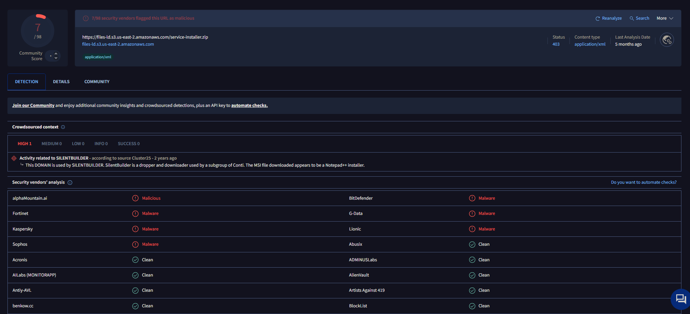
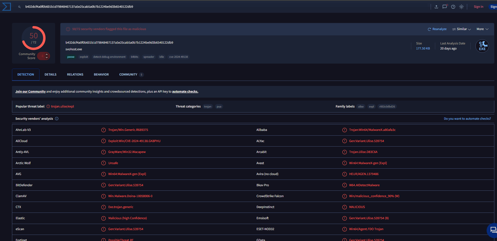
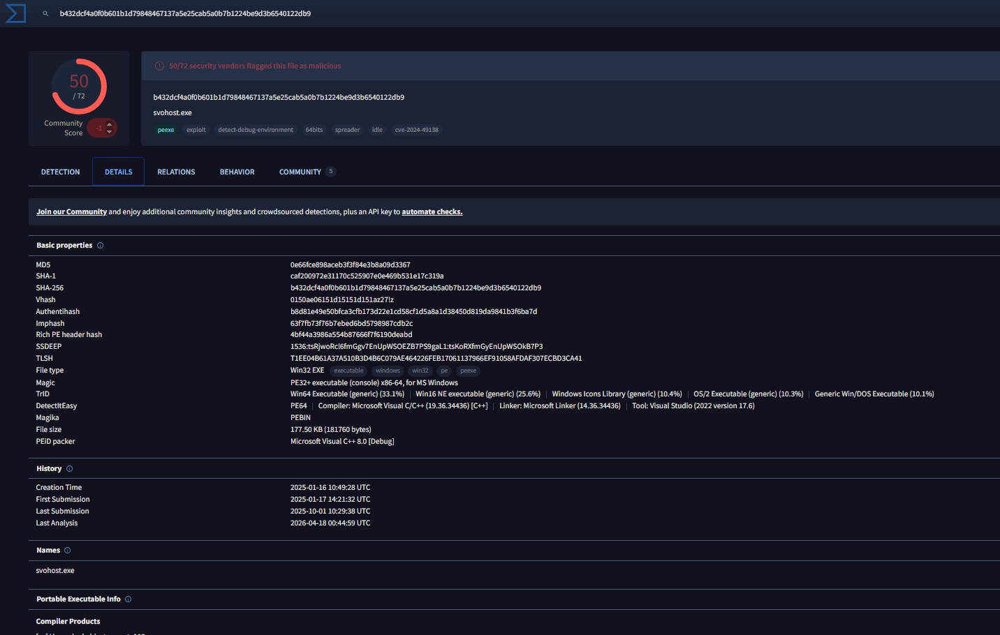

# LetsDefend SOC Investigation - SOC-335-CVE-2024-49138 Exploitation Detected

## Overview

While monitoring alerts in the LetsDefend SOC environment, an alert titled `SOC-335-CVE-2024-49138 Exploitation Detected` was identified on the host Victor. I took ownership of the case from the monitoring channel and began investigating the endpoint activity, network connections, and related threat intelligence to determine whether the system had been compromised.

## Initial Investigation

The first thing I checked was the alert details and related logs connected to Victor. The alert showed repeated inbound RDP connection attempts coming from the external IP address `185.107.56.141` targeting port `3389`.

Since exposed RDP services are commonly targeted for brute-force activity and unauthorized access attempts, I pivoted into the Threat Intelligence section in LetsDefend to investigate the IP further. The IP already had a brute-force related tag associated with it, which immediately increased the likelihood that the activity was malicious rather than normal remote administration traffic.

At this point, it looked possible that the attacker may have gained initial access through exposed RDP services on the endpoint.

## Endpoint Investigation

After identifying the suspicious inbound activity, I moved into the EDR section for Victor to inspect process execution and command-line activity on the host.

One of the first suspicious findings was a process named `svohost.exe`. The filename closely imitated the legitimate Windows `svchost.exe` process, which is a common technique attackers use to hide malware in plain sight and avoid immediate detection.

The process activity looked abnormal, so I investigated the parent commands and related execution history further.

I then found PowerShell activity showing the system downloading a password-protected ZIP archive named `service-installer.zip` from the domain:

`files-ld.s3.us-east-2.amazonaws.com`

The commands also showed the archive being extracted with 7-Zip into:

`C:\temp\service_installer\`

After extraction, the suspicious `svohost.exe` binary was executed from that directory.

This confirmed that the payload was not only downloaded successfully, but also executed on the endpoint.

## Threat Intelligence and Malware Analysis

To validate whether the downloaded infrastructure and malware were known malicious indicators, I checked both the URL and file hash in VirusTotal.

The URL analysis showed suspicious and malicious detections connected to the AWS-hosted file delivery infrastructure.

I then searched the hash of the suspicious executable. The hash results matched malicious detections associated with the alert and confirmed that the binary was recognized as malware.

Reviewing the detailed analysis section provided additional information about the malware behavior, indicators, and detections from multiple security vendors.

VirusTotal also resolved the malicious infrastructure to the IP address `52.219.109.210`. I attempted to locate direct communication logs involving this IP inside LetsDefend Log Management, but no matching events were found. This was likely caused by AWS infrastructure rotation, CDN behavior, or incomplete visibility in available logging sources.

Even without direct communication logs to that resolved IP, the evidence still clearly showed that the endpoint successfully accessed the malicious infrastructure through PowerShell and downloaded the payload.

## Containment

Since the malware execution was confirmed and the endpoint showed signs of compromise, containment actions were necessary to prevent additional attacker activity or further spread inside the environment.

The Victor endpoint was quarantined from the network through the LetsDefend EDR platform.

## Conclusion

The investigation confirmed that Victor was compromised following suspicious inbound RDP activity originating from a known brute-force related IP address. The attacker was able to execute PowerShell commands that downloaded a password-protected archive from externally hosted infrastructure, extract the files locally, and run a masquerading executable named `svohost.exe`.

Threat intelligence and VirusTotal analysis confirmed that both the file hash and delivery infrastructure were associated with malicious activity. Although direct command-and-control communication was not fully observed in the available logs, the successful malware delivery and execution provided enough evidence to classify the endpoint as compromised.

The AWS S3 infrastructure used in this incident appeared to function mainly as malware hosting and payload delivery rather than a confirmed command-and-control server. No evidence of active beaconing or operator tasking was identified during the investigation.

## What I Learned

This investigation helped reinforce how exposed RDP services can quickly become an entry point for attackers, especially when brute-force activity is already associated with the source IP. It also showed how attackers often use simple masquerading techniques such as changing a filename from `svchost.exe` to `svohost.exe` to avoid immediate suspicion.

Another important takeaway was understanding the difference between malware delivery infrastructure and actual command-and-control communication. Even though the malware was downloaded successfully from AWS-hosted infrastructure, that alone does not automatically confirm active C2 activity.

The investigation also provided more hands-on experience using EDR telemetry, process analysis, threat intelligence lookups, VirusTotal correlation, and containment actions within the LetsDefend SOC environment.

## Recommendations

- Disable direct external RDP exposure whenever possible
- Enforce MFA for remote access services
- Monitor PowerShell usage and suspicious archive extraction activity
- Restrict unauthorized execution from temporary directories
- Implement stronger endpoint detection rules for masquerading processes
- Continue monitoring for additional indicators related to the malicious hash and infrastructure
