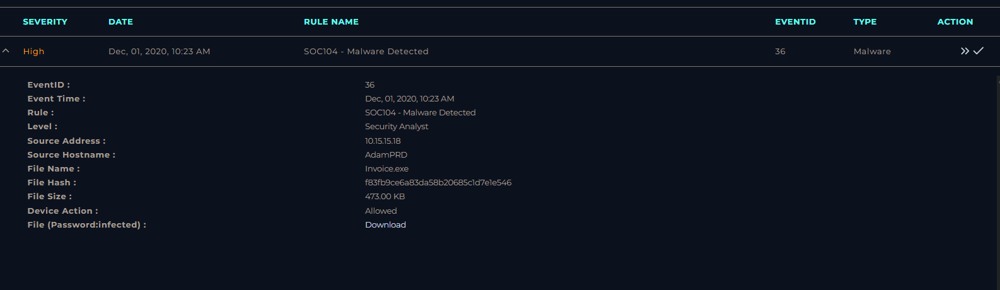
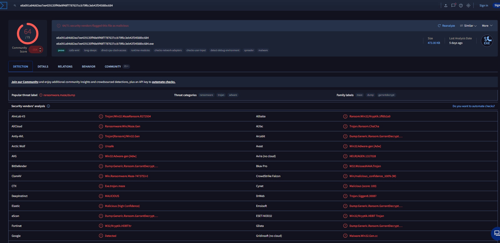
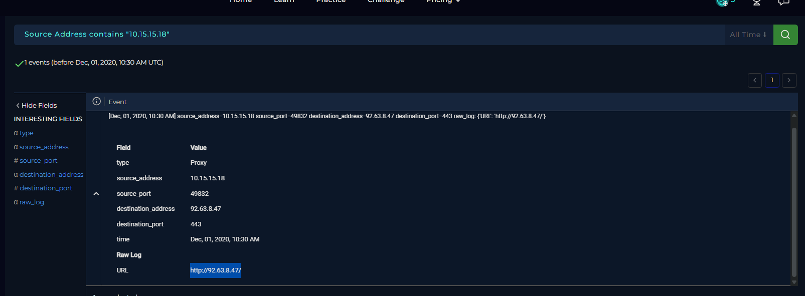
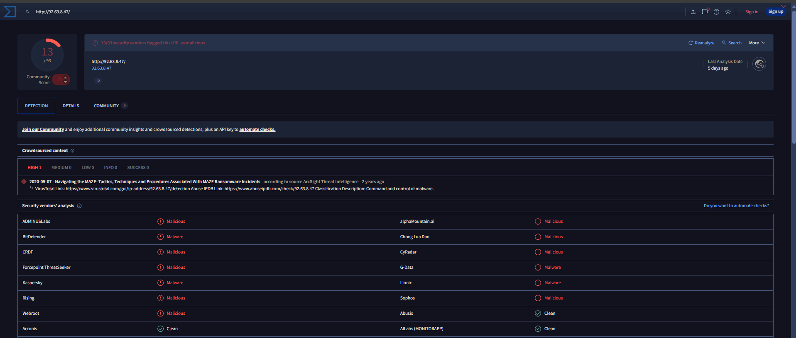
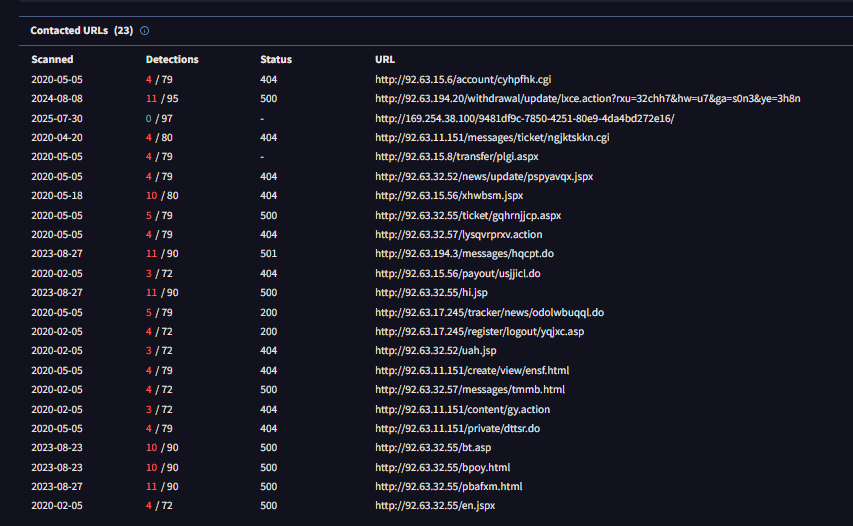
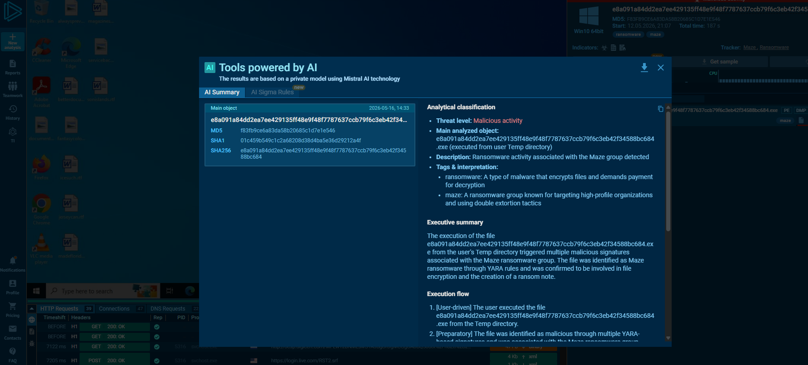
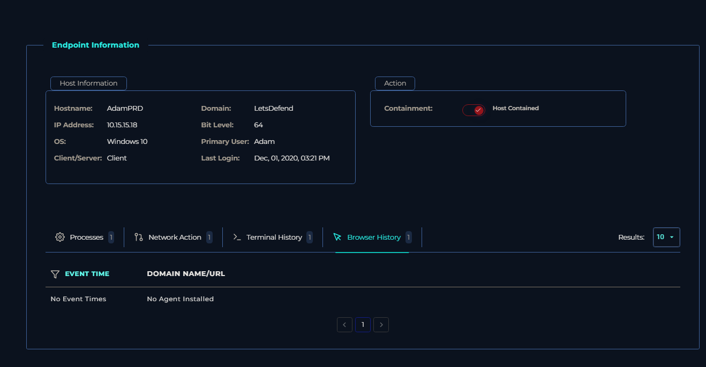
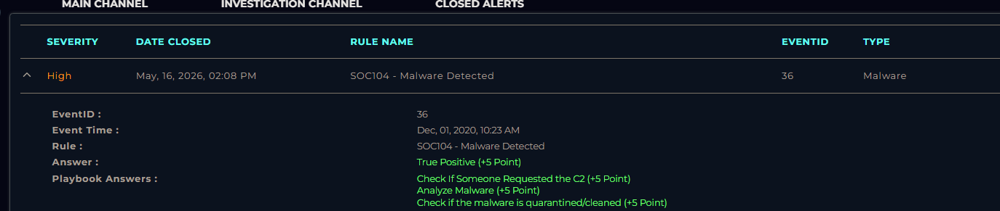

# Malware Investigation and Containment

## Objective

The goal of this investigation was to analyze a malware detection alert, validate whether it was a true positive, identify the affected machine, investigate related network activity, and determine whether the host communicated with a malicious command and control (C2) server before taking containment actions.

## Alert Analysis

I started by reviewing the alert generated in the SIEM. The alert showed a high severity malware detection event related to `invoice.exe` on the host `AdamPRD` with the source address `10.15.15.18`.

From the alert details, I gathered important indicators including:

- Source IP address
- File hash
- File name
- URL information
- Hostname of the affected device

After creating the case, I moved into endpoint investigation to identify the affected workstation and review its activity.

## Endpoint Investigation

Using the source address `10.15.15.18`, I searched the endpoint security platform to locate the affected machine. I reviewed:

- Process network activity
- Terminal history
- Browser history

All of these sections returned little to no useful activity, so I shifted focus toward the indicators collected from the alert itself.

## Hash Reputation Analysis

I copied the file hash from the alert and searched it in VirusTotal to verify whether the file was malicious.

VirusTotal identified the file as malicious and associated it with ransomware activity. This confirmed that the alert was most likely a true positive and not a false alarm.

## Log Investigation

To investigate possible communications from the infected machine, I moved into log management and filtered logs containing the source address `10.15.15.18`.

During log review, I identified outbound communication from the victim host to the destination IP address `92.63.8.47` over HTTP.

This gave me another indicator to investigate further.

## URL and Network Analysis

I took the URL/IP connection observed in the logs and searched it in VirusTotal.

VirusTotal flagged the destination as malicious, which strengthened the evidence that the device was communicating with attacker infrastructure.

I also reviewed additional contacted URLs related to the malware activity.

## Sandbox Analysis

To better understand the malware behavior, I searched the file hash in AnyRun and reviewed available sandbox reports.

The AI summary explained the malware activity and behavior observed during execution.

I then reviewed the network connections section in the sandbox and confirmed communication with the IP address `92.63.8.47`, indicating command and control (C2) activity.

This confirmed that the malware attempted outbound communication to attacker-controlled infrastructure.

## Containment

Since the host showed indicators of active malicious behavior and C2 communication, I proceeded with containment to isolate the device from the network.

This prevented further communication and reduced the risk of additional compromise or lateral movement.

## Case Closure

After completing the investigation, I submitted the correct case responses and verified that all answers were accurate.

## Conclusion

This investigation helped me better understand how SOC alert triage works in a real workflow. I learned how to move from an initial alert into endpoint investigation, validate indicators using external intelligence sources like VirusTotal and AnyRun, review logs for suspicious network activity, and determine whether an alert is a true positive.

The investigation also helped solidify my understanding of malware analysis and incident response workflows, especially identifying C2 communication and making containment decisions based on collected evidence.

### Skills Learned

- Malware Triage and IOC Validation  
- Log Analysis and Threat Investigation  
- Endpoint Containment and Incident Response  
